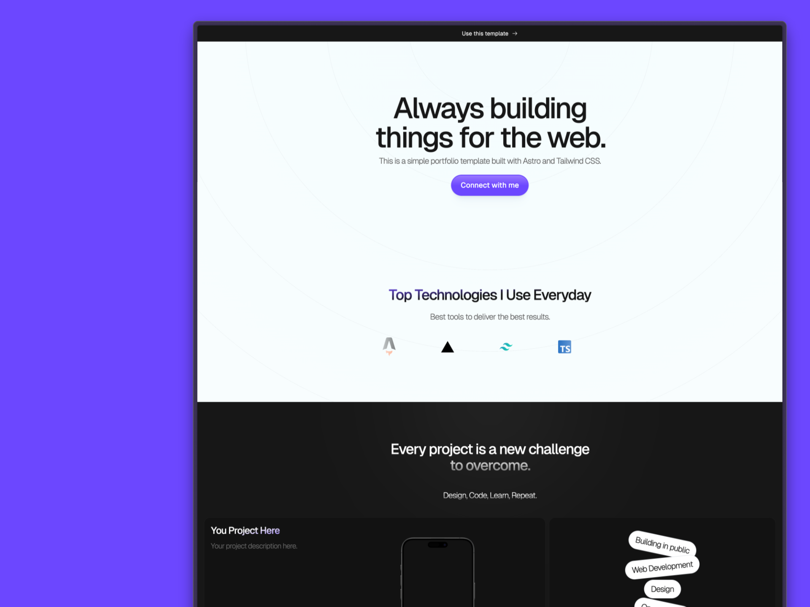

# Litefolio - Astro Portfolio Starter Template

This is a free portfolio starter template built with Astro and Tailwind CSS.

## Live Demo

**[litefolio.vercel.app](https://litefolio.vercel.app)**

## Preview



## Deploy

Easily deploy the project with the button below. It will clone the repository to your GitHub account and create a new deployment on your Vercel dashboard.

[](https://vercel.com/new/clone?repository-url=https%3A%2F%2Fgithub.com%2Fgonzalochale%2Flitefolio)

## Installation

If you are reading this on github, you can click on the "Use this template" button above to create a new repository from astroship to your account. Then you can do a `git clone` to clone it to your local system.

Alternatively, you can clone the project directly from this repo to your local system.

### 1. Clone the repo

```bash
git clone git@github.com:gonzalochale/litefolio.git myPortfolio
# or
git clone git@github.com:gonzalochale/litefolio.git .
```

The `.` will clone it to the current directory so make sure you are inside your project folder first.

### 2. Install Dependencies

```bash
npm install
# or
yarn install
# or (recommended)
pnpm install
```

### 3. Start development Server

```bash
npm run dev
# or
yarn dev
# or (recommended)
pnpm dev
```

### Preview & Build

```bash
npm run preview
npm run build
# or
yarn preview
yarn build
# or (recommended)
pnpm preview
pnpm build
```

We recommend using [pnpm](https://pnpm.io/) to save disk space on your computer.

### Other Commands

```bash
pnpm astro ...
pnpm astro add
pnpm astro --help
```

## Project Structure

Inside of your Astro project, you'll see the following folders and files:

``` bash
/
├── public/
│   └── ...
├── src/
│   ├── components/
│   │   └── ...
│   ├── layouts/
│   │   └── ...
│   └── pages/
│       └── ...
└── package.json
```

Astro looks for `.astro` or `.md` files in the `src/pages/` directory. Each page is exposed as a route based on its file name.

Any static assets, like images, can be placed in the `public/` directory.

## TailwindCSS

TailwindCSS is already configured in this repo, so you can start using it without any installation.

## Contributing

Contributions are welcome! Please open an issue or submit a pull request for any bugs, improvements, or new features.

## Credits

We would like to express our gratitude to the following open-source projects and their contributors:

- **SVG Icons**: Thank you to [SVGL](https://www.svgl.app) and [Radix Icons](https://www.radix-ui.com/icons) for providing the high-quality SVG icons used in this project.

Your contributions to the open-source community are invaluable and greatly appreciated. Thank you for making this project possible!
